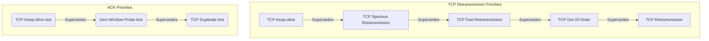

## 7.5. [TCP Analysis](https://www.wireshark.org/docs/wsug_html_chunked/ChAdvTCPAnalysis.html)

By default, Wireshark’s TCP dissector tracks the state of each TCP session and provides additional information when problems or potential problems are detected. Analysis is done once for each TCP packet when a capture file is first opened. Packets are processed in the order in which they appear in the packet list. You can enable or disable this feature via the “Analyze TCP sequence numbers” TCP dissector preference.

For analysis of data or protocols layered on top of TCP (such as HTTP), see [Section 7.8.3, “TCP Reassembly”](https://www.wireshark.org/docs/wsug_html_chunked/ChAdvReassemblySection.html#ChAdvReassemblyTcp "7.8.3. TCP Reassembly").

**Figure 7.7. “TCP Analysis” packet detail items**

TCP Analysis flags are added to the TCP protocol tree under “SEQ/ACK analysis”. Each flag is described below. Terms such as “next expected sequence number” and “next expected acknowledgement number” refer to the following:

**Next expected sequence number**

The last-seen sequence number plus segment length. Set when there are no analysis flags and for zero window probes. This is initially zero and calculated based on the previous packet in the same TCP flow. Note that this may not be the same as the tcp.nxtseq protocol field.

**Next expected acknowledgement number**

The last-seen sequence number for segments. Set when there are no analysis flags and for zero window probes.

**Last-seen acknowledgment number**

Always set. Note that this is not the same as the next expected acknowledgment number.

**Last-seen acknowledgment number**

Always updated for each packet. Note that this is not the same as the next expected acknowledgment number.

**Forward Direction**

Direction of data transfer

**Reverse Direction**

Direction of Acks for the data

#### TCP ACKed unseen segment

Set when all of the following are true:

- The expected next acknowledgement number is set for the reverse direction and
- expected next acknowledgement number is less than the current acknowledgement number.

#### TCP Dup ACK *&lt;frame&gt;*#*&lt;acknowledgement number&gt;*

Set when all of the following are true:

- The segment size is zero.
- The window size is non-zero and hasn’t changed.
- The next expected sequence number and last-seen acknowledgment number are non-zero (i.e. the connection has been established).
- SYN, FIN, and RST are not set.

#### TCP Fast Retransmission

Set when all of the following are true:

- This is not a keepalive packet.
- In the forward direction, the segment size is greater than zero or the SYN or FIN is set.
- The next expected sequence number is greater than the current sequence number.
- We have more than two duplicate ACKs in the reverse direction.
- The current sequence number equals the next expected acknowledgement number.
- We saw the last acknowledgement less than 20ms ago.

Supersedes “Out-Of-Order” and “Retransmission”.

#### TCP Keep-Alive

Set when all of the following are true:

- The segment size is zero or one
- The current sequence number is one byte less than the next expected sequence number
- any of SYN, FIN, or RST flags are set.

Supersedes “Fast Retransmission”, “Out-Of-Order”, “Spurious Retransmission”, and “Retransmission”.

#### TCP Keep-Alive ACK

Set when all of the following are true:

- The segment size is zero.
- The window size is non-zero and hasn’t changed.
- The current sequence number is the same as the next expected sequence number.
- The current acknowledgement number is the same as the last-seen acknowledgement number.
- The most recently seen packet in the reverse direction was a keepalive.
- The packet is not a SYN, FIN, or RST.

Supersedes “Dup ACK” and “ZeroWindowProbeAck”.

#### TCP Out-Of-Order

Set when all of the following are true:

- This is not a keepalive packet.
- In the forward direction, the segment length is greater than zero or the SYN or FIN is set.
- The next expected sequence number is greater than the current sequence number.
- The next expected sequence number and the next sequence number differ.
- The last segment arrived within the Out-Of-Order RTT threshold.
    - The threshold is either the value shown in the “iRTT” (tcp.analysis.initial_rtt) field under “SEQ/ACK analysis” if it is present,
    - or the default value of 3ms if it is not.

Supersedes “Retransmission”.

#### TCP Port numbers reused

Set when all of the following are true:

- SYN flag is set (not SYN+ACK),
- We have an existing conversation using the same addresses and ports
- The sequence number is different than the existing conversation’s initial sequence number.

#### TCP Previous segment not captured

Set when all of the following are true:

- The current sequence number is greater than the next expected sequence number.

#### TCP Spurious Retransmission

Checks for a retransmission based on analysis data in the reverse direction. Set when all of the following are true:

- The SYN or FIN flag is set.
- This is not a keepalive packet.
- The segment length is greater than zero.
- Data for this flow has been acknowledged. That is, the last-seen acknowledgement number has been set.
- The next sequence number is less than or equal to the last-seen acknowledgement number.
- Note: If the ACK didn't make it to the server, this isn't really a Spurious Retransmission - it's just a standard Retransmission. Wireshark must mark it as a Spurious Retransmission because the ACK was seen in the trace

Supersedes “Fast Retransmission”, “Out-Of-Order”, and “Retransmission”.

#### TCP Retransmission

Set when all of the following are true:

- This is not a keepalive packet.
- In the forward direction, the segment length is greater than zero or the SYN or FIN flag is set.
- The next expected sequence number is greater than the current sequence number.

#### TCP Window Full

Set when all of the following are true:

- the segment size is non-zero
- we know the window size in the reverse direction
- our segment size exceeds the window size in the reverse direction.

#### TCP Window Update

Set when the all of the following are true:

- The segment size is zero.
- The window size is non-zero and not equal to the last-seen window size.
- The sequence number is equal to the next expected sequence number.
- The acknowledgement number is equal to the last-seen acknowledgement number.
- None of SYN, FIN, or RST are set.

#### TCP ZeroWindow

Set when all of the following are true:

- the receive window size is zero
- none of SYN, FIN, or RST flags are set.

The *window* field in each TCP header advertises the amount of data a receiver can accept. If the receiver can’t accept any more data it will set the window value to zero, which tells the sender to pause its transmission. In some specific cases this is normal — for example, a printer might use a zero window to pause the transmission of a print job while it loads or reverses a sheet of paper. However, in most cases this indicates a performance or capacity problem on the receiving end. It might take a long time (sometimes several minutes) to resume a paused connection, even if the underlying condition that caused the zero window clears up quickly.

#### TCP ZeroWindowProbe

Set when all of the following are true:

- the sequence number is equal to the next expected sequence number
- the segment size is one
- last-seen window size in the reverse direction was zero.

If the single data byte from a Zero Window Probe is dropped by the receiver (not ACKed), then a subsequent segment should not be flagged as retransmission if all of the following conditions are true for that segment: * The segment size is larger than one. * The next expected sequence number is one less than the current sequence number.

This affects “Fast Retransmission”, “Out-Of-Order”, or “Retransmission”.

#### TCP ZeroWindowProbeAck

Set when the all of the following are true:

- The segment size is zero.
- The window size is zero.
- The sequence number is equal to the next expected sequence number.
- The acknowledgement number is equal to the last-seen acknowledgement number.
- The last-seen packet in the reverse direction was a zero window probe.

Supersedes “TCP Dup ACK”.

#### TCP Ambiguous Interpretations

Some captures are quite difficult to analyze automatically, particularly when the time frame may cover both Fast Retransmission and Out-Of-Order packets. A TCP preference allows to switch the precedence of these two interpretations at the protocol level.

#### TCP Conversation Completeness

TCP conversations are said to be complete when they have both opening and closing handshakes, independently of any data transfer. However we might be interested in identifying complete conversations with some data sent, and we are using the following bit values to build a filter value on the tcp.completeness field :

- 1 : SYN
- 2 : SYN-ACK
- 4 : ACK
- 8 : DATA
- 16 : FIN
- 32 : RST

For example,

- A conversation containing only a three-way handshake will be found with the filter 'tcp.completeness==7' (1+2+4)
- A complete conversation with data transfer will be found with a longer filter as closing a connection can be associated with FIN or RST packets, or even both : 'tcp.completeness==31 or tcp.completeness==47 or tcp.completeness==63'